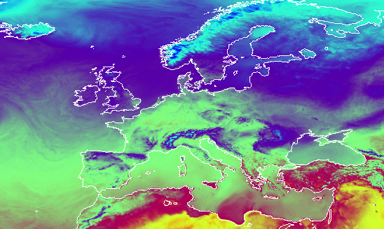

# Euroweather frontend service
This service provides location based synthetic seasonal weather data for Europe. The service is based on gridded weather forecasts from Deutsche Wetterdienst which are downloaded and stored throughout the season by the [Euroweather backend service](https://github.com/H2020-IPM-Decisions/Euroweather-backend). The data for each location is interpolated from the 7*7km grid. 

When a request for a specific location is made for the first time during a season, the data from January 1st and up til the request date needs to be collected from the from the backend's rather big archive of NetCDF files. Thus, the user will not get the data immediately from the first request. These location initializations take place once or every second hour (depending on the backend server's capacity). After that, the data are cached in this service's database for quick/immediate access, and daily requests to the backend for updates ensure that the database stays up-to-date.



&copy; 2021 NIBIO

Authors: Tor-Einar Skog (NIBIO)

## License
```
 Copyright (c) 2021 NIBIO <https://www.nibio.no/> and Met Norway <https://www.met.no/>
 
 This program is free software: you can redistribute it and/or modify
 it under the terms of the GNU Affero General Public License as published by
 the Free Software Foundation, either version 3 of the License, or
 (at your option) any later version.
 
 This program is distributed in the hope that it will be useful,
 but WITHOUT ANY WARRANTY; without even the implied warranty of
 MERCHANTABILITY or FITNESS FOR A PARTICULAR PURPOSE.  See the
 GNU Affero General Public License for more details.
 
 You should have received a copy of the GNU Affero General Public License
 along with this program.  If not, see <http://www.gnu.org/licenses/>.
 
```


## Setting up the system
### Software requirements
* Ubuntu Linux, tested with v 20
* Python3
* [Flask](https://flask.palletsprojects.com/en/2.0.x/)
* PostgreSQL, tested with v12
* Apache web server

#### Installing software requirements
Example using Ubuntu

``` bash
sudo apt-get install --assume-yes postgresql postgis apache2 libapache2-mod-wsgi-py3 python3.8-venv
```
### Initialize the database (tested in Ubuntu)
The files for initializing the database are found in this repo's `ddl/` folder
As user postgres, using psql or pgAdmin4, run all the statements in `ddl_001.sql` 

If you get the error:

```
ERROR:  invalid locale name: "en_US.UTF-8"
```
You may have to run 

```
sudo locale-gen en_US.UTF-8
```
And then restart PostgreSQL to make the `CREATE DATABASE` statement run properly.

As user postgres or europe_season_adm run the weather_params_init.sql script to populate the `parameter` table.

### Installing the app
Clone the repository, set up the virtualenv and install app dependencies

``` bash
git clone https://github.com/H2020-IPM-Decisions/Euroweather-frontend.git
cd Euroweather-frontend/
python3 -m venv
source venv/bin/activate
pip3 install -r requirements.txt
```
Set up your local configuration, copying `app/europe-seasondata_example.ini` to `app/europe-seasondata.ini` and setting your PostgreSQL user password for the `europe_season_adm` user (the one you defined in the `CREATE USER` statement in `ddl_01.sql`). Also, make sure the `coms_init_path` and `coms_update_path` point to existing folders that the Euroweather-backend server has access to using e.g. rsync.

### Testing your installation
If you're running the application locally (e.g. for development purposes), you can start the app like this:

``` bash
source init_flask_dev
cd app/
flask run
```
Then you can test e.g. `http://localhost:5000/weather_data?longitude=10.961&latitude=55.109`

### Configuring the Apache webserver
For test and prod deployments, we recommend using Apache as web server and mod_wsgi to communicate with the Flask web app. Create an Apache vhost like this:

``` apache
<VirtualHost *:80>
   ServerName euroweather.ipmdecisions.nibio.no
   AddDefaultCharset UTF-8
 
   # WSGI setup for euroweather
   WSGIDaemonProcess euroweather user=nibio group=nibio threads=5 python-home=[FULL_PATH_TO_YOUR_VIRTUALENV]venv
   WSGIProcessGroup euroweather
   WSGIApplicationGroup %{GLOBAL}
 
   WSGIScriptAlias / [FULL_PATH_TO_YOUR_APP]/wsgi.py
   <Directory [FULL_PATH_TO_YOUR_APP]>
                 <Files wsgi.py>
                         <RequireAll>
                                 Require all granted
                         </RequireAll>
                 </Files>
         </Directory>
 
 </VirtualHost>

```


### Importing data on a regular basis

```bash
 30 * * * * source Euroweather-frontend/venv/bin/activate; python3 /home/nibio/  Euroweather-frontend/app/batch/import_data.py
```

#### Purpose of the com_*/ folders
The folders are suggested folders where you place the *.req files for tickets, so that in your `app/europe-seasondata.ini` would have the setting e.g.

```
[backend]
coms_init_path = /opt/Europe-seasondata/webapp/coms_init
coms_update_path = /opt/Europe-seasondata/webapp/coms_update
```

...where `/opt/Europe-seasondata/webapp/` would be the root folder of this web application

#### Syncing files with backend (gatekeeper)

The communication between frontend and backend happens with the exchange of *.req files and *.res files
The front end issues req files that contain lat-lon pairs, simply like this:

```
51.109 10.961
```

The files are named `[site_id].req`

When the backend runs, it collects all these coordinates and reads through the NetCDF files and returns data by replacing the `[site_id].req` file with a `[site_id].res`  file with json data (that needs to be converted to the IPM Decisions weather data format by this application)

The backend performs all the file syncing

### Maintenance mode
If you need to inform the users about ongoing maintenance, set this value in europe-seasondata.ini:

```
[misc]
is_maintenance_mode = True
```

All requests will get the 503 when this value is set to True
